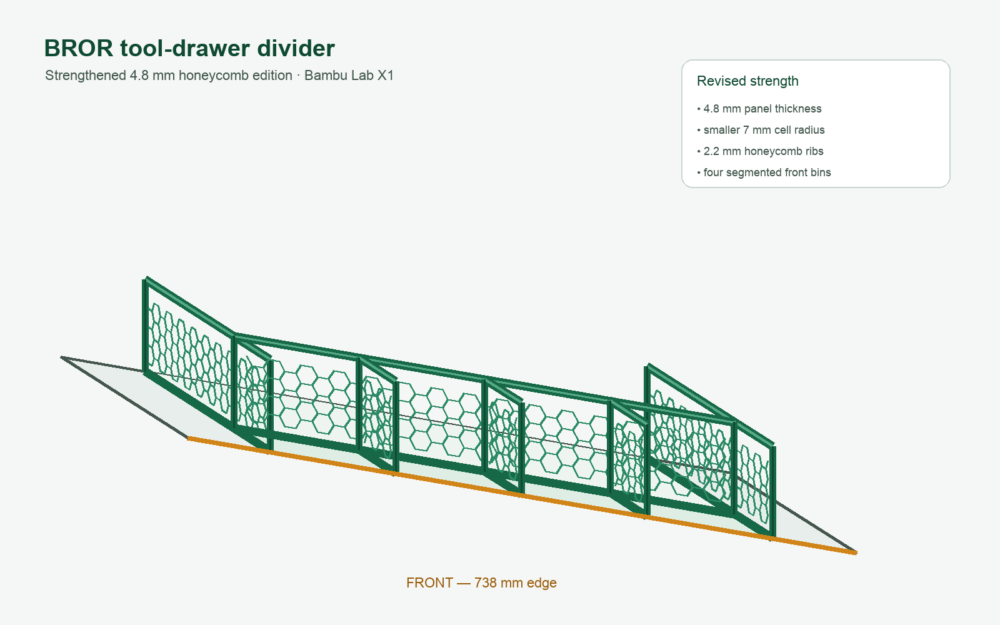

# BROR tool-drawer divider

A modular, honeycomb tool-drawer divider designed for a **738 mm wide x 367 mm
deep x 120 mm high** drawer. The 738 mm edge is the front.

The parts fit the Bambu Lab X1/X1C build volume. The largest part is only
183.7 x 105 x 4.8 mm and every panel is supplied flat on the build plate.

## Strengthened edition

This version replaces the original thinner design after print testing:

- Panel thickness increased from 2.4 to **4.8 mm**.
- Honeycomb cell radius reduced from 13 to **7 mm**.
- Honeycomb ribs increased from 1.8 to **2.2 mm**.
- Solid 10 mm coupling rails reinforce the top and bottom edges.
- Clip channels increased to 5.4 mm for the thicker panels.

The previous clips do not fit this edition; print the included updated clips.

## Download

[Download all STL files as a ZIP](drawer-divider-x1-honeycomb-stls.zip)

## Parts to print

| Quantity | Part |
| ---: | --- |
| 4 | [Honeycomb side panel](drawer-divider-x1-honeycomb-stls/honey_side_panel_182_5mm.stl) |
| 3 | [Honeycomb front rail panel](drawer-divider-x1-honeycomb-stls/honey_front_rail_panel_183_7mm.stl) |
| 3 | [Honeycomb front segmentation panel](drawer-divider-x1-honeycomb-stls/honey_front_segment_panel_107_4mm.stl) |
| 8 | [Straight slide clip](drawer-divider-x1-honeycomb-stls/straight_slide_clip.stl) |
| 10 | [T slide clip](drawer-divider-x1-honeycomb-stls/t_slide_clip.stl) |

Printing one extra of each clip type is recommended.

## Layout

- Four front compartments, approximately 136 x 109 mm each.
- Two full-depth side compartments, approximately 90 mm wide.
- One large open center/rear compartment.
- Divider height: 105 mm.
- Approximate installed height with clips: 107.4 mm.

## Assembly

1. Join two side panels for each full-depth side divider. Fit one straight clip
   below and one above each seam.
2. Join the three front rail panels. Fit straight clips below and above both
   seams.
3. Connect the front rail between the two side dividers using a T clip below
   and above each junction.
4. Connect the three short segmentation panels to the front rail using a T
   clip below and above each junction. Their other ends rest against the front
   drawer wall.
5. Place the completed assembly in the drawer with the four small compartments
   along the 738 mm front edge.

The slide clips have a wider lead-in at the opening, followed by a snug section
that keeps the panels aligned. No glue or screws are required.

## Suggested print settings

- Material: PETG recommended.
- Layer height: 0.20 mm.
- Nozzle: 0.4 mm.
- Walls: 4.
- Infill: 20% for the clips; the panel geometry already contains the open
  honeycomb structure.
- Supports: none.
- Print panels in the supplied flat orientation.
- Print clips closed-side down with their channels facing upward.
